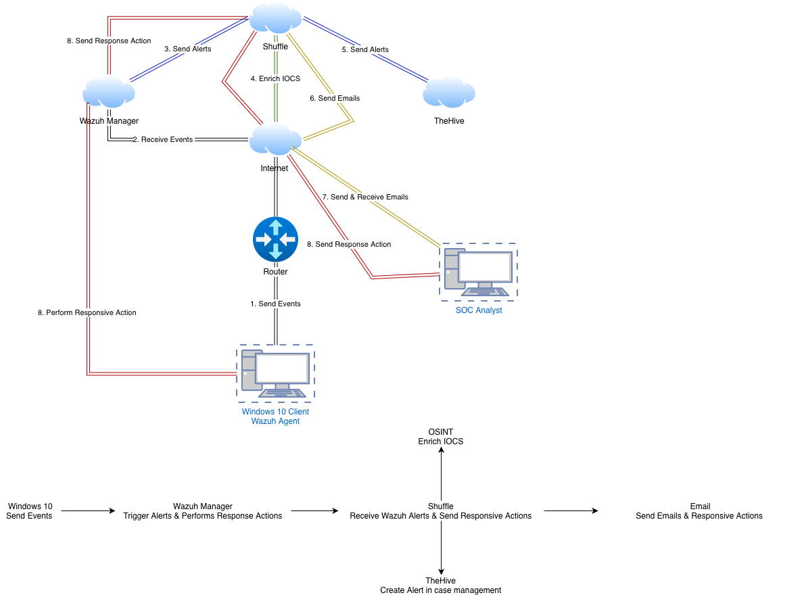
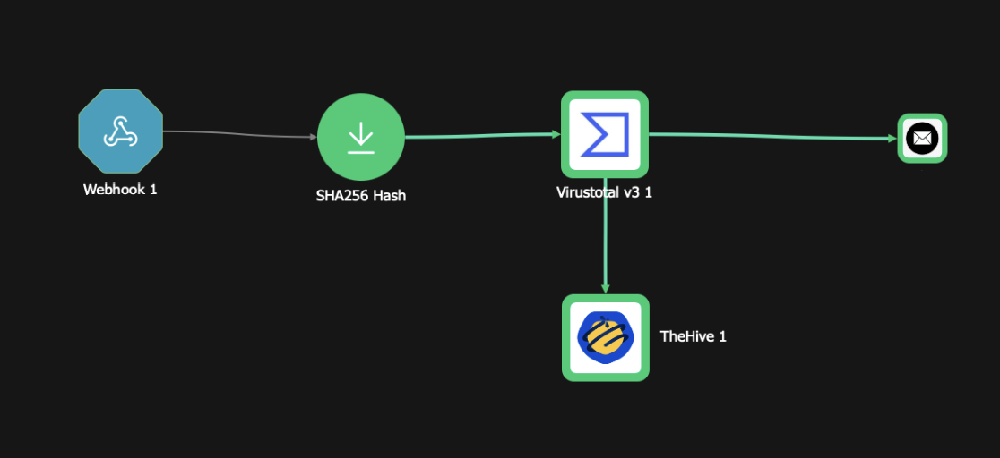
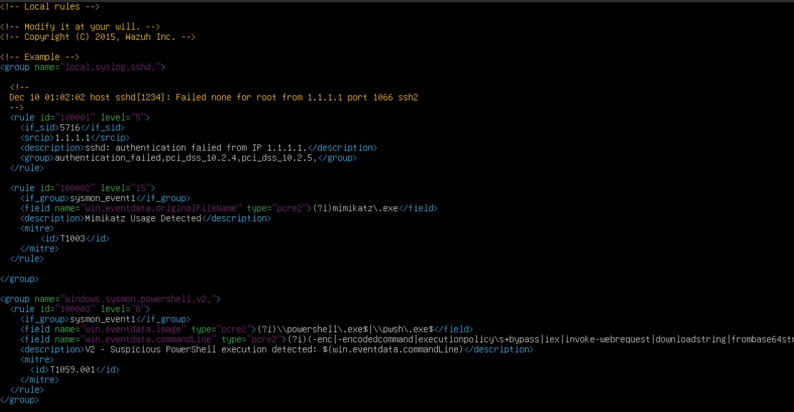
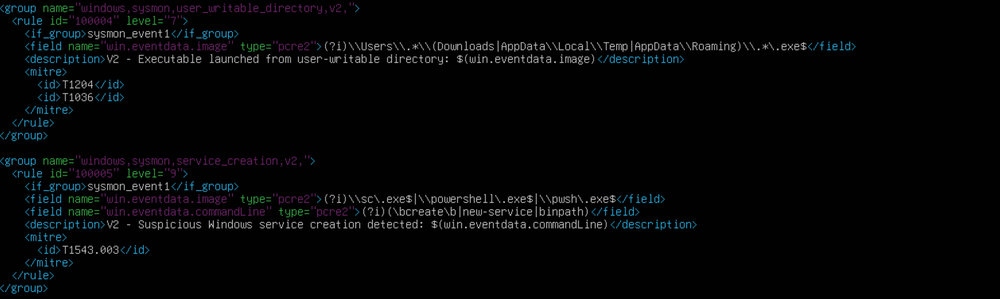

# SOC Automation Lab

> An end-to-end Security Operations Center workflow that detects suspicious Windows activity, enriches alerts with threat intelligence, and automatically creates incidents for investigation.


## Overview

This project implements a practical SOC automation pipeline in a virtualized lab environment. A Windows endpoint generates detailed security telemetry through Sysmon, which is collected and analyzed by Wazuh. Custom Wazuh rules identify suspicious activity and forward relevant alerts to Shuffle, where an automated workflow extracts indicators of compromise, queries VirusTotal, notifies the analyst, and creates a case in TheHive.

The lab focuses on the complete alert lifecycle—from endpoint telemetry to analyst-ready incident—rather than deploying each security tool in isolation. It demonstrates how SIEM, SOAR, threat-intelligence, and incident-response technologies can work together to reduce manual triage and improve response consistency.

> [!IMPORTANT]
> Configuration examples committed to this repository must use placeholders for IP addresses, webhook URLs, credentials, and API keys. Never commit production secrets.

## Architecture




### Data flow

1. Sysmon records high-value Windows events, including process creation telemetry.
2. The Wazuh agent forwards the endpoint events to the Wazuh manager.
3. Custom detection rules identify the targeted suspicious behavior.
4. Wazuh sends the matching alert to a Shuffle webhook.
5. Shuffle extracts the relevant observable and requests a VirusTotal reputation check.
6. The workflow adds the enrichment result to the alert context.
7. Shuffle notifies the analyst and creates a structured incident in TheHive.

## Project Objectives

- Build a complete, isolated SOC lab using virtual machines.
- Collect detailed Windows endpoint telemetry with Sysmon.
- Centralize and analyze security events with Wazuh.
- Design custom detection logic for suspicious process activity.
- Forward actionable alerts to a SOAR platform through a webhook.
- Enrich observables automatically with VirusTotal threat intelligence.
- Create consistent, analyst-ready incidents in TheHive.
- Notify analysts without requiring continuous SIEM dashboard monitoring.
- Understand and document the integration between endpoint, SIEM, SOAR, and case-management technologies.

## Technologies

| Technology | Role in the lab |
| --- | --- |
| **Windows 11** | Monitored endpoint and source of security events |
| **Sysmon** | Detailed Windows system and process telemetry |
| **Wazuh Agent** | Endpoint log collection and secure event forwarding |
| **Wazuh Manager** | Event decoding, correlation, custom detection, and alert generation |
| **Shuffle** | SOAR orchestration and automated response workflow |
| **VirusTotal** | File-hash reputation and threat-intelligence enrichment |
| **TheHive** | Incident and case management for analyst investigation |
| **Email** | Automated analyst notification channel |
| **VirtualBox** | Virtualized and isolated lab infrastructure |

## Detection Workflow

The detection chain begins when a process executes on the Windows endpoint. Sysmon records the activity and provides contextual fields such as the image path, command line, user, parent process, and file hashes. The Wazuh agent collects this event and sends it to the manager for decoding and rule evaluation.

Four independent custom rules evaluate Sysmon process-creation events. Each rule targets a different behavior: Mimikatz execution, suspicious PowerShell commands, execution from user-writable directories, or suspicious Windows service creation. Every matching rule can trigger the Shuffle automation workflow directly.

When the final rule matches, Wazuh forwards the alert as JSON to Shuffle. The automation workflow parses the event, extracts the observable, enriches it, and creates a case containing the original alert and threat-intelligence context.

## Custom Detection Rules

The custom Wazuh rules are stored in `wazuh/local_rules.xml`. Rules `100002` through `100005` inspect Sysmon Event ID 1 telemetry and cover four distinct endpoint behaviors.

| Rule ID | Level | Detection | Logic | MITRE ATT&CK |
| --- | ---: | --- | --- | --- |
| **100002** | 15 | Mimikatz usage | Detects `mimikatz.exe` through the Sysmon `OriginalFileName` field. | `T1003` — OS Credential Dumping |
| **100003** | 8 | Suspicious PowerShell execution | Detects `powershell.exe` or `pwsh.exe` with suspicious command-line indicators such as encoded commands, execution-policy bypass, `IEX`, web requests, download strings, or Base64 decoding. | `T1059.001` — PowerShell |
| **100004** | 7 | Execution from a user-writable directory | Detects executables launched from user-controlled locations including `Downloads`, `AppData\\Local\\Temp`, and `AppData\\Roaming`. | `T1204` — User Execution; `T1036` — Masquerading |
| **100005** | 9 | Suspicious Windows service creation | Detects service-creation commands launched through `sc.exe`, PowerShell, or `pwsh.exe`, including `create`, `New-Service`, and `binPath` indicators. | `T1543.003` — Windows Service |

The rules are behavior-specific rather than a parent-child chain. All four rely on the `sysmon_event1` group, add contextual event fields to their descriptions, and can independently generate an actionable alert.

> [!NOTE]
> The rules in this lab demonstrate detection engineering in a controlled environment. Production deployment would require additional tuning, allowlisting, validation against normal activity, and false-positive monitoring.

## SOAR Automation

Shuffle receives the Wazuh alert through a dedicated webhook and runs the response workflow automatically.

The workflow performs the following actions:

1. Receives and validates the Wazuh JSON payload.
2. Extracts useful fields such as the rule ID, hostname, user, process path, command line, and hash.
3. Normalizes the file hash before using it in downstream actions.
4. Queries VirusTotal for reputation and detection results.
5. Combines the original alert with the enrichment data.
6. Sends an email notification to the analyst.
7. Creates a case or alert in TheHive with investigation-ready context.

Wazuh is configured to forward alerts from rules `100002`, `100003`, `100004`, and `100005` to the same Shuffle webhook in JSON format. The public configuration example must replace the live endpoint with `SHUFFLE_WEBHOOK_URL`.



## VirusTotal Enrichment

VirusTotal adds external threat context to the observable extracted from the Wazuh event. The Shuffle workflow submits the available file hash to the VirusTotal API and retrieves reputation information such as detection statistics and analysis results.

This enrichment helps the analyst answer an important triage question immediately: **is the observed file known to security vendors as malicious or suspicious?** The result is added to the downstream notification and TheHive case so the analyst does not need to perform the lookup manually.

API credentials are stored in the platform's secure connection settings and are never hard-coded in repository files.

## Incident Management

TheHive provides a central location for investigation and case tracking. For every qualifying Wazuh alert, Shuffle creates a structured record containing the most useful information available from the pipeline, including:

- Alert title and description
- Wazuh rule ID and severity
- Endpoint and user information
- Process image and command line
- File hash or other observable
- VirusTotal enrichment results
- Event timestamp and source context
- Tags and classification fields for triage

This creates a repeatable handoff between automated detection and human investigation while preserving the evidence required for follow-up actions.

## Repository Structure

```text
wazuh-soc-automation-lab/
├── README.md
├── LICENSE
├── wazuh/
│   ├── ossec.conf.example       # Sanitized Wazuh configuration
│   └── local_rules.xml          # Custom rules 100002–100005
└── docs/
    └── screenshots/
        ├── architecture-diagram.png
        ├── shuffle-workflow.png
        ├── wazuh-rules-100002-100003.png
        └── wazuh-rules-100004-100005.png
```

The repository contains the Wazuh configuration used for alert forwarding, the custom detection rules, and the available visual documentation. The Shuffle workflow and Sysmon configuration are not included as exported files. VirusTotal enrichment, email notification, and TheHive incident creation are documented in the workflow description, although separate result screenshots are not available.

## Screenshots

> [!CAUTION]
> The Wazuh-to-Shuffle integration screenshot is intentionally excluded because it contains the complete webhook URL. Only a redacted version should be published.

### Lab architecture


### Shuffle workflow


### Wazuh rules — Mimikatz and suspicious PowerShell



### Wazuh rules — user-writable directory and service creation



## Improvements over the Original Tutorial

This project was inspired by a guided SOC automation lab, then documented and structured as an independent engineering project. The implementation extends the learning exercise through:

- A clearly documented end-to-end architecture and data flow
- Four behavior-specific Wazuh rules mapped to MITRE ATT&CK
- Sanitized and reusable configuration examples
- Structured VirusTotal enrichment rather than a manual reputation check
- Consistent incident creation with investigation context in TheHive
- A maintainable repository layout for sanitized Wazuh configurations and visual evidence
- Explicit security guidance for secrets, API keys, webhook URLs, and internal addresses
- Documentation of operational limitations and realistic production-hardening requirements

These changes make the lab reproducible, easier to review, and closer to the workflow expected in a real SOC environment.

## Future Improvements

- Add more behavioral detections mapped to MITRE ATT&CK techniques.
- Enrich IP addresses, domains, URLs, and additional file observables.
- Add automated containment actions with approval gates.
- Introduce allowlists and suppression logic to reduce false positives.
- Add alert deduplication and severity-based workflow routing.
- Track detection coverage and test rules against repeatable attack simulations.
- Add workflow failure handling, retries, and analyst escalation paths.
- Integrate a ticketing or team-messaging platform for broader collaboration.
- Deploy the environment with infrastructure-as-code for repeatable builds.
- Define incident-response metrics such as mean time to acknowledge and mean time to respond.

## Key Skills Demonstrated

- SOC architecture and security-tool integration
- Windows endpoint monitoring and Sysmon telemetry analysis
- SIEM administration and Wazuh rule development
- Detection engineering and alert triage
- SOAR workflow design and webhook integration
- REST API usage and JSON data transformation
- Threat-intelligence enrichment with VirusTotal
- Incident and case management with TheHive
- Security documentation and configuration sanitization
- Troubleshooting across multiple systems and network boundaries

## Security and Privacy

Before publishing changes, verify that the repository does not contain:

- API keys, passwords, tokens, or authentication headers
- Active webhook or tunnel URLs
- Public or private infrastructure addresses that should remain undisclosed
- Personal email addresses or usernames
- Screenshots containing credentials, tokens, personal data, or browser session details

Use clear placeholders such as `WAZUH_MANAGER_IP`, `SHUFFLE_WEBHOOK_URL`, and `YOUR_API_KEY` in all public configuration examples.

## License

This project is licensed under the [MIT License](LICENSE). You may use, modify, and distribute the project in accordance with the terms of that license.

---

If this project helped you understand how SIEM, SOAR, threat intelligence, and incident response fit together, consider giving the repository a star.
